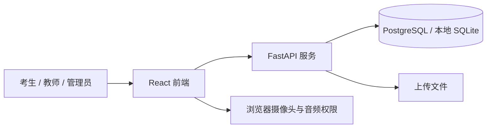

<div align="center">
  
  <h1>衡鉴智考 · 高校考试全流程与能力测评平台</h1>
  <p>从题库与组卷，到考试、监考、评阅和学习反馈的一体化演示平台。</p>
  <p>
    
    
    
  </p>
  <p>
    <a href="#平台能力">平台能力</a> ·
    <a href="#本地体验">本地体验</a> ·
    <a href="docs/部署说明.md">部署指南</a> ·
    <a href="docs/架构说明.md">架构说明</a>
  </p>
</div>

---

衡鉴智考面向高校考试场景，把题库、线上考试、监考、阅卷和学情分析串成可追踪的工作流。项目独立开发，产品方向参考高校智能考试平台；与科大讯飞不存在官方隶属、授权或合作关系。

> [!IMPORTANT]
> 仓库提供可运行的前后端和演示数据。部分指挥大屏、监考事件、趋势图及资源指标为演示内容，不代表已接入真实生产数据；AI 评阅和监考结论需要人工复核，不能将示例指标视为准确率保证。

## 平台能力

| 流程 | 功能页面 |
|---|---|
| 建题与组卷 | 分层题库、试题录入、标签管理、智能组卷、试卷审核 |
| 考试与监考 | 考生答题、考场态势、设备监看、异常提示、事件记录 |
| 阅卷与归档 | 客观题处理、主观题辅助评阅、教师复核、扫描阅卷、印刷管理 |
| 教学分析 | 成绩统计、知识图谱、课程目标达成度、学生能力画像 |
| 平台管理 | 组织角色、管理工作台、资源监控与数据导入 |

## 系统架构



本地开发使用 SQLite；生产 Compose 使用 PostgreSQL 16。前端通过 `/api` 访问后端，线上部署建议由宿主机 Nginx 提供 HTTPS。完整拓扑、账号初始化和备份命令见[部署指南](docs/部署说明.md)。

## 本地体验

Windows PowerShell 中先启动后端：

```powershell
cd backend
python -m venv .venv
.\.venv\Scripts\python.exe -m pip install -r requirements.txt
.\.venv\Scripts\python.exe seed.py
.\.venv\Scripts\python.exe run.py
```

再开一个终端启动前端：

```powershell
cd frontend
npm ci
npm run dev
```

访问 [本地演示页面](http://localhost:5173)。`seed.py` 仅用于本地或隔离的演示环境；公网生产部署请遵循[部署指南](docs/部署说明.md)创建独立管理员，不要初始化固定演示账号。

<details>
<summary>查看本地演示账号</summary>

| 角色 | 账号 | 密码 |
|---|---|---|
| 管理员 | `admin` | `admin123` |
| 教师 | `teacher` | `teacher123` |
| 监考员 | `proctor` | `proctor123` |
| 考生 | `stu01`～`stu12` | `123456` |

</details>

## 文档与部署

| 文档 | 阅读内容 |
|---|---|
| [部署指南](docs/部署说明.md) | Docker Compose、HTTPS、首个管理员、备份、更新与验收 |
| [架构说明](docs/架构说明.md) | 模块和数据流 |
| [硬指标对齐](docs/指标对齐.md) | 演示指标与实现范围 |

生产环境需要真实数据源接入、权限与隐私评估、性能与安全测试，并由教师复核重要评阅结论。学校 SSO、教务同步和第三方题库凭据需按实际供应方另行配置。仓库目前没有独立的开源许可证文件；公开可见不等于允许复制、分发或商用。

