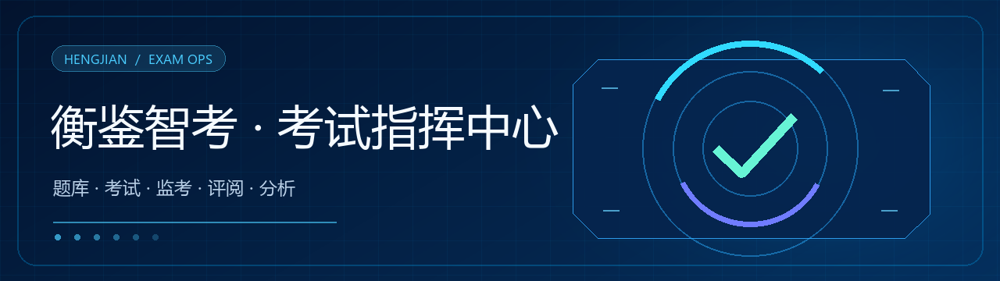

# 衡鉴智考 · 高校考试全流程与能力测评平台



[完整部署指南](docs/部署说明.md) · [架构说明](docs/架构说明.md) · [指标对齐](docs/指标对齐.md)

**衡鉴智考**是一套面向高校考试场景的管理与演示平台，覆盖题库建设、智能组卷、线上考试、监考、AI 辅助评阅、扫描阅卷与学情分析。它希望把分散的考试环节放进一条清晰、可追踪的工作流，并在成绩之外提供课程目标和学生能力分析视图。

> 从一道试题开始，连接一场考试、一次评阅与一份可行动的学习反馈。

项目代号：`hengjian-ai-exam`。本项目独立开发，产品方向参考高校智能考试与监考平台；与科大讯飞不存在官方隶属、授权或合作关系。

## 平台能做什么

| 环节 | 能力 |
|---|---|
| 建题与组卷 | 分层题库、标签管理、试题录入、智能出题与组卷、试卷审核 |
| 考试与监考 | 考生线上作答、考场态势、摄像头监看、异常提示与考试记录 |
| 阅卷与归档 | AI 辅助主观题评阅、教师复核、答题卡扫描阅卷、印刷和归档管理 |
| 教学分析 | 成绩统计、知识图谱、课程目标达成度、学生能力画像与学习建议 |
| 平台管理 | 组织与角色管理、全局工作台、资源监控、数据导入及演示流程 |

## 项目状态与数据说明

当前仓库提供可运行的前后端项目和演示数据。部分大屏指标、监考事件、趋势图及资源使用率用于界面演示，不代表真实生产环境的实时测量结果。人脸检测、语音分析和 AI 评阅的实际效果取决于设备、模型、数据质量及部署环境；上线前应完成真实数据源接入、性能与安全测试，并由教师复核重要评阅结论。请勿将界面示例或配置中的目标指标解读为已验证的准确率保证。

## 技术栈

- **后端**：Python 3.13 · FastAPI · SQLAlchemy · SQLite（可切换 PostgreSQL 应对高并发）· JWT 认证
- **前端**：Vite 5 · React 18 · react-router-dom 6 · axios · ECharts 5
- **AI 视觉**：face-api.js（人脸检测/活体/多人/离席，模型本地化）+ Web Audio（语音音量异常）

## 核心功能

1. **考试全流程**：智能题库、多目标组卷、线上考试、扫描阅卷
2. **多模态监考**：人脸比对、行为识别、语音异常、活体核验、防切屏；多源融合判定 + 哈希链证据链
3. **AI 智能评阅**：客观题精确比对、主观题（关键词+TF-IDF+结构）、英文作文、翻译、思政主观题、口语测评
4. **知识图谱能力画像**：知识点→能力→课程目标三级图谱，50+ 维能力画像，课程目标达成度，个性化建议
5. **管理大屏**：考试指挥中心、扫描阅卷可视化、弹性中台 KPI 监控
6. **弹性中台**：标准 REST 契约、模块化接入、水平扩展设计

## 快速启动

完整部署（Docker Compose、HTTPS、备份与更新）请看[部署指南](docs/部署说明.md)。

### 后端（端口 8000）

```powershell
cd backend
python -m venv .venv                 # 首次
.venv\Scripts\python.exe -m pip install -r requirements.txt   # 首次
.venv\Scripts\python.exe seed.py     # 初始化演示数据（幂等，可重复执行）
.venv\Scripts\python.exe run.py      # 启动服务
```

### 前端（端口 5173，已配置 /api 代理到 8000）

```powershell
cd frontend
npm install
npm run dev
```

浏览器打开 http://localhost:5173

## 演示账号

| 角色 | 账号 | 密码 |
|---|---|---|
| 管理员 | admin | admin123 |
| 教师 | teacher | teacher123 |
| 监考员 | proctor | proctor123 |
| 考生 | stu01 ~ stu12 | 123456 |

## 目录结构

```
exam-system/
├── backend/
│   ├── app/
│   │   ├── models.py          # 数据模型（用户/题库/试卷/考试/监考/画像/扫描阅卷）
│   │   ├── config.py          # 功能目标与阈值配置
│   │   ├── services/
│   │   │   ├── grading_service.py    # AI 评阅 + 教师一致性 + 口语测评
│   │   │   ├── proctor_service.py    # 多模态融合监考 + 哈希链证据链 + KPI 仿真
│   │   │   ├── knowledge_service.py  # 50+ 维能力画像 + 匹配度 + 建议
│   │   │   ├── paper_service.py      # 多目标组卷
│   │   │   └── assessment_service.py # 自动评阅流水线
│   │   └── routers/           # auth/questions/papers/exams/grading/proctor/capability/dashboard/system/scan
│   ├── seed.py                # 幂等种子数据
│   ├── run.py                 # 服务入口
│   └── exam.db                # 本地演示数据库（不提交到 Git）
└── frontend/
    ├── src/
    │   ├── components/        # Layout/EChart/RadarChart/KnowledgeGraph/ProctorEngine
    │   └── pages/             # Login/StudentHome/ExamRoom/ExamResult/CapabilityPortrait
    │                          # TeacherHome/QuestionBank/PaperAssembly/GradingQueue/ScanGrading
    │                          # CommandCenter/SystemMonitor
    └── public/models/         # face-api.js 本地模型权重
```

## 文档索引

- [架构说明](docs/架构说明.md)
- [硬指标对齐](docs/指标对齐.md)
- [部署指南](docs/部署说明.md)

> 演示账号只用于本地或隔离的演示环境。生产部署请按部署指南创建独立管理员；不要运行演示数据初始化脚本。

> 本仓库公开可见，但目前未附开源许可证；在明确添加许可证前，代码默认保留原作者权利，不代表允许他人复制、分发或商用。
