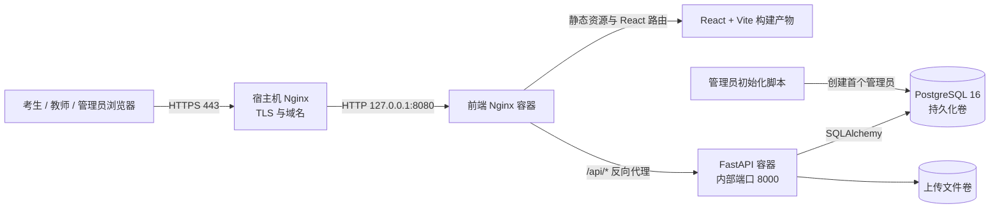

# 衡鉴智考部署指南

本文覆盖 Windows 本地开发，以及 Ubuntu/Debian 服务器上的 Docker Compose 部署。生产部署使用 PostgreSQL 保存业务数据，Docker 卷持久化数据库和上传文件；公网入口默认只监听服务器本机，由宿主机 Nginx 处理 HTTPS。

## 一、服务架构



访问流程：浏览器请求网站 → 宿主机 Nginx 终止 HTTPS → 前端 Nginx 返回页面；`/api/` 请求由前端 Nginx 转发到 FastAPI。数据库与后端不直接暴露公网端口。

## 二、服务器准备

建议使用 Ubuntu 22.04/24.04 或 Debian 12，至少 2 核 CPU、4 GB 内存和 20 GB 磁盘；正式考试并发、摄像头推流和数据量增加时应单独评估容量。准备一个解析到服务器公网 IP 的域名，并在防火墙只开放 TCP 22、80、443。

安装 Docker Engine 与 Compose 插件，按 Docker 官方文档完成 Linux 安装。确认以下命令可用：

```bash
docker --version
docker compose version
```

## 三、获取代码与设置密钥

把 `<GitHub用户名>` 替换为仓库所有者；如果仓库为私有，先在服务器配置 SSH Deploy Key 或 GitHub CLI 登录。

```bash
git clone https://github.com/<GitHub用户名>/hengjian-ai-exam.git
cd hengjian-ai-exam
cp .env.example .env
```

生成强随机值并编辑 `.env`：

```bash
openssl rand -hex 32
```

将生成的随机串填入 `SECRET_KEY`，并为 `POSTGRES_PASSWORD` 设置另一条独立随机密码。`APP_PORT` 默认 8080，可按需调整。`.env` 已加入 Git 忽略规则，不能提交到仓库或发给他人。

## 四、启动生产服务

```bash
docker compose up -d --build
docker compose ps
docker compose logs -f backend
```

首次启动时，FastAPI 会创建空数据库所需的表和能力维度。前端容器仅绑定到 `127.0.0.1:8080`。在服务器上检查：

```bash
curl -I http://127.0.0.1:8080/
curl http://127.0.0.1:8080/api/health
```

### 创建首个管理员

生产部署不要运行演示种子 `backend/seed.py`。使用交互式输入创建自己的管理员账号，密码不会显示在终端：

```bash
read -r -p '管理员登录名: ' ADMIN_USERNAME
read -r -s -p '管理员密码（至少 12 位）: ' ADMIN_PASSWORD; echo
export ADMIN_USERNAME ADMIN_PASSWORD
docker compose exec -e ADMIN_USERNAME -e ADMIN_PASSWORD backend python create_admin.py
unset ADMIN_USERNAME ADMIN_PASSWORD
```

该脚本会创建管理员；若同名账号已存在，则设置为管理员并更新密码。公开注册接口只允许创建学生账号，不能通过注册参数获得管理员或教师权限。

演示数据只应在本地或隔离的测试环境初始化：

```bash
docker compose run --rm backend python seed.py
docker compose run --rm backend python upgrade_feature_pack.py
```

演示用户及固定密码见项目首页 README。不要在公网服务器上启用演示账号。

## 五、配置宿主机 HTTPS

安装 Nginx 与 Certbot，然后为域名申请证书。先配置 HTTP 虚拟主机：

```nginx
server {
    listen 80;
    server_name exam.example.com;
    location / {
        proxy_pass http://127.0.0.1:8080;
        proxy_http_version 1.1;
        proxy_set_header Host $host;
        proxy_set_header X-Real-IP $remote_addr;
        proxy_set_header X-Forwarded-For $proxy_add_x_forwarded_for;
        proxy_set_header X-Forwarded-Proto $scheme;
        proxy_read_timeout 120s;
    }
}
```

保存为 `/etc/nginx/sites-available/exam.example.com`，启用并申请 HTTPS：

```bash
sudo ln -s /etc/nginx/sites-available/exam.example.com /etc/nginx/sites-enabled/
sudo nginx -t && sudo systemctl reload nginx
sudo certbot --nginx -d exam.example.com
```

Certbot 会将 TLS 配置写入 Nginx 站点。之后用 `https://exam.example.com` 访问。浏览器摄像头和麦克风需要安全上下文（HTTPS 或 localhost）。

## 六、更新与回滚

更新前先备份数据库；然后拉取代码并重新构建容器：

```bash
docker compose exec -T db sh -c 'pg_dump -U "$POSTGRES_USER" "$POSTGRES_DB"' > backup-$(date +%F-%H%M).sql
git pull --ff-only
docker compose up -d --build
docker compose ps
```

本项目当前没有 Alembic 等数据库迁移版本管理。重要升级前应先在备份或测试环境验证数据库兼容性，不能只依赖 `create_all()` 修改已有列结构。回滚代码时切回已知可用的 Git 提交，再执行 `docker compose up -d --build`；如果升级修改过数据结构，需评估并恢复对应数据库备份。

## 七、备份与恢复

定期备份 PostgreSQL，并将备份复制到服务器以外的受控存储。上传文件卷也应纳入备份：

```bash
docker compose exec -T db sh -c 'pg_dump -U "$POSTGRES_USER" "$POSTGRES_DB"' > exam-$(date +%F).sql
docker run --rm -v hengjian-ai-exam_uploaded_files:/data -v "$PWD:/backup" alpine \
  tar -czf /backup/uploads-$(date +%F).tar.gz -C /data .
```

恢复前停止写入并确认备份对应同一版本。数据库可用 `psql` 导入 SQL 备份；上传文件卷需先解压覆盖。Compose 实际卷名前缀由项目目录决定，用 `docker volume ls` 确认名称后再操作。

## 八、常用运维命令

```bash
docker compose ps                         # 服务状态
docker compose logs -f --tail=200 backend # 后端日志
docker compose restart backend            # 重启后端
docker compose down                       # 停止服务，保留具名卷
docker compose up -d                      # 重新启动
```

`docker compose down -v` 会删除数据库和上传文件卷，造成数据丢失；日常停止服务不要附加 `-v`。

## 九、Windows 本地开发

需要 Python 3.10+、Node.js 18+ 和 npm。分别打开两个终端：

后端：

```powershell
cd backend
python -m venv .venv
.venv\Scripts\python.exe -m pip install -r requirements.txt
.venv\Scripts\python.exe seed.py
.venv\Scripts\python.exe run.py
```

前端：

```powershell
cd frontend
npm ci
npm run dev
```

打开 <http://localhost:5173>。Vite 将 `/api` 代理到后端 `http://127.0.0.1:8000`。API 文档地址为 <http://127.0.0.1:8000/docs>。生产 Docker 部署不使用 Vite 代理。

## 十、常见问题

| 现象 | 检查方式 |
|---|---|
| 页面能打开但接口失败 | `docker compose ps`、`docker compose logs backend`；确认 `/api/` 代理及后端健康状态 |
| 容器启动提示 SECRET_KEY 未设置 | 在 `.env` 中设置至少 32 字符的随机密钥 |
| 数据库连接失败 | 等待 `db` 健康检查通过，检查 `.env` 的数据库名、用户名和密码 |
| HTTPS 页面无法开启摄像头 | 检查域名证书、浏览器站点权限与系统设备权限 |
| 文件导入提示过大 | 检查 `frontend/nginx.conf` 的 `client_max_body_size`，并确认宿主机空间充足 |
| 页面刷新后 404 | 确认前端 Nginx 的 `try_files $uri $uri/ /index.html;` 配置已生效 |

## 十一、安全与运行说明

- 生产服务必须使用独立随机 `SECRET_KEY` 和数据库密码；不要提交 `.env`、数据库文件或上传内容。
- 数据库没有映射公网端口，前端只绑定本机 8080。公网流量经宿主机 Nginx 和 HTTPS 进入。
- `seed.py` 会创建固定演示账号，只能用于隔离的开发/演示环境。
- 当前公开注册仅创建学生角色。教师、监考员和管理员账号应由受控流程创建。
- 学校 SSO、真实教务系统同步、短信/邮件服务、外部题库凭据需按实际供应方另行配置；本指南不会生成这些第三方凭据。
- 数据库 `create_all()` 只创建缺失表，不能代替已有生产数据库的结构迁移工具。
